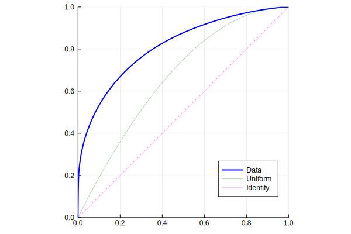

# Plotting

For both `ABCcurve` and `ABCanalysis` there are recipes for [Plots.jl](http://docs.juliaplots.org/latest/) visualisations. These understand the usual Plots.jl parameters like `markershape` etc.

---
The plot for `ABCcurve` shows the curve in comparison with ABC curves for uniformly distributed values (green) and identical values (magenta). These can be switches off with `comparison=false`.
```julia
curve = ABCcurve(data)
plot(curve)
```



The plot for `ABCanalysis` extends the curve plot with line boundaries for the *A*, *B* and *C* sets (red lines) and markers for the *Pareto point* (green), *Break Even point* (red) and the *Submarginal point* (blue). It also annotates the sets with their respective size. The annotations can be turned off with `annotate=false`.
```julia
analysis = ABCanalysis(data)
plot(analysis)
```

